<div align="center">

<!-- ============================================================================== -->
<!-- 3D HIGH-TECH ANIMATED VECTOR BANNER (SELF-HOSTED IN REPO)                      -->
<!-- ============================================================================== -->


<!-- ============================================================================== -->
<!-- ANIMATED TYPING SVG TELEMETRY                                                 -->
<!-- ============================================================================== -->
<a href="https://github.com/MOHAMMADREZAABEDINPOOR/PIMX_MORPH">
  
</a>

<br/>

<!-- ============================================================================== -->
<!-- BADGES MATRIX WITH WORKING ANCHORS                                             -->
<!-- ============================================================================== -->
[](https://www.gnu.org/licenses/agpl-3.0)
[](https://react.dev/)
[](https://www.typescriptlang.org/)
[](https://vitejs.dev/)
[](https://developer.mozilla.org/en-US/docs/Web/API/Web_Crypto_API)
[](https://pages.cloudflare.com/)
[](#persian-documentation)

<p align="center">
  <b>PIMX_MORPH</b> is a military-grade, zero-knowledge universal data transformation laboratory, cryptographic hash workbench, and structure conversion platform. Engineered with React 18, TypeScript 5, and the native hardware-accelerated Web Crypto API, PIMX_MORPH provides security auditors, cryptographers, penetration testers, and backend engineers with a zero-latency suite of 40+ encoding, hashing, entropy analysis, and data-morphing algorithms — executing 100% locally inside browser memory with absolute zero server transmission.
</p>

<!-- ============================================================================== -->
<!-- QUICK NAVIGATION ANCHORS                                                       -->
<!-- ============================================================================== -->
[Project Overview](#-project-overview--core-philosophy) •
[Mathematical Foundations](#-mathematical-foundations--entropy-analysis) •
[Directory Anatomy](#-exhaustive-directory--module-anatomy) •
[Transformation Catalog](#-transformation-catalog--algorithmic-matrix) •
[Architecture & Dataflow](#-system-architecture--zero-knowledge-pipeline) •
[Security & Privacy](#-security-model--threat-vectors) •
[Installation & Deployment](#-installation--deployment-blueprints) •
[Library Usage](#-using-as-a-standalone-typescript-library) •
[توضیحات فارسی](#persian-documentation) •
[Roadmap](#-strategic-engineering-roadmap) •
[License](#-copyleft-license--legal-attribution)

</div>

---

## ⚡ Project Overview & Core Philosophy

### The Developer's Data Dilemma
Modern software engineering and cybersecurity research demand constant data conversions between heterogeneous representations:
1. **Network Payloads**: Inspecting raw network packets requires moving fluidly between ASCII, Hexadecimal byte arrays, Base64 streams, and binary buffers.
2. **Cryptographic Validation**: Verifying message authenticity requires computing SHA-256, SHA-512, or Keccak hashes and measuring Shannon entropy to detect whether a buffer contains ciphertext or compressed data.
3. **Data Interchange**: API integration frequently requires translating nested JSON structures into YAML configurations, XML manifests, tabular CSVs, or relational SQL insert statements.

### The Security Hazard of Online Converters
Most web developers paste sensitive production payloads, API keys, private tokens, and internal database dumps into arbitrary online converter websites. These unverified platforms routinely:
- Log request payloads into centralized access logs.
- Transmit sensitive developer data to third-party ad trackers and analytics brokers.
- Introduce latency and fail during offline development or air-gapped security operations.

### The PIMX_MORPH Solution
**PIMX_MORPH** addresses this vulnerability through an uncompromising zero-knowledge architecture:
- 🛡️ **100% In-Browser Execution**: Every mathematical conversion, hashing routine, and string manipulation is performed exclusively within the browser's JavaScript V8/SpiderMonkey runtime.
- ⚡ **Hardware-Accelerated Web Crypto API**: Cryptographic digests utilize native OS-level CPU instructions (AES-NI, SHA extensions) via `window.crypto.subtle`.
- 🧮 **Shannon Entropy Telemetry**: Integrated real-time entropy profiling flags high-randomness buffers, identifying encrypted payloads and obfuscated malware shellcode.
- 🌐 **True Internationalization**: Comprehensive 23-language localization with dynamic Right-to-Left (RTL) typography for Persian, Arabic, and Hebrew.

---

## 🧮 Mathematical Foundations & Entropy Analysis

### 1. Shannon Information Entropy ($H$)
PIMX_MORPH includes a real-time entropy profiler based on Claude Shannon's 1948 landmark theorem. The entropy $H(X)$ of an arbitrary byte buffer $X$ is computed as:

$$H(X) = - \sum_{i=0}^{255} P(b_i) \cdot \log_2 P(b_i)$$

Where:
- $P(b_i) = \frac{\text{Count}(b_i)}{N}$ is the empirical probability of byte value $b_i$ appearing in a payload of total length $N$.
- $\log_2$ normalizes the entropy score to the range $[0.0, 8.0]$ bits per byte.

#### Entropy Classification Thresholds in PIMX_MORPH:
| Entropy Score ($H$) | Data Classification | Typical Characteristics |
| :---: | :--- | :--- |
| **$0.00 - 1.50$** | Extremely Low | Monotonous sequences (e.g., zero-padding `0x00...`, repeated characters). |
| **$1.50 - 3.50$** | Low / Structured | Source code (HTML, CSS, JSON, SQL), sparse XML documents. |
| **$3.50 - 5.00$** | Moderate | Natural human language prose (English, Persian, Spanish literature). |
| **$5.00 - 6.80$** | High Structure | Base64 encoded blobs, compiled binary executables (.ELF, .PE). |
| **$7.20 - 8.00$** | Maximum Randomness | Strong cryptographic ciphertext (AES-GCM, ChaCha20), CSPRNG keys, compressed archives (GZIP, ZSTD). |

---

### 2. Cryptographic Compression & Hash Pipelines
All hashing routines utilize the **Merkle-Damgård construction** and the **Davies-Meyer compression function**:

```
Message: M ──► [Padding (1000...00 || Length)] ──► [Block M0] ──► [Block M1] ──► ... ──► [Block Mn]
                                                         │              │                     │
Initial Vector IV ───────────────────────────────────────► [  f  ] ────► [  f  ] ─────────► [  f  ] ──► Final Digest H
```

For SHA-256:
- **Block Size**: 512 bits (64 bytes).
- **Word Size**: 32 bits.
- **Rounds**: 64 rounds utilizing non-linear logical functions ($Ch$, $Maj$, $\Sigma_0$, $\Sigma_1$, $\sigma_0$, $\sigma_1$) and 64 predetermined fractional constants from the cube roots of the first 64 prime numbers.

---

### 3. Bitwise Transformation Algebra
- **Base64 Bit-Packing**: 3 octets (24 bits) are projected onto 4 sextets (6 bits each), mapped via lookup table $\mathcal{T}_{\text{B64}} = [\text{A-Z}, \text{a-z}, \text{0-9}, +, /]$:
  $$\text{Index}_0 = \frac{b_0 \gg 2}{}, \quad \text{Index}_1 = ((b_0 \ \& \ 3) \ll 4) \ | \ (b_1 \gg 4)$$
- **ROT13 Modular Inversion**: An involutory permutation over the English alphabet where ciphering and deciphering are mathematically identical:
  $$C(x) = (x + 13) \pmod{26}, \quad C(C(x)) = (x + 26) \pmod{26} \equiv x$$

---

## 📂 Exhaustive Directory & Module Anatomy

```
d:/code/PIMXMORPH/
│
├── index.html                       # HTML5 single-page application shell with security meta headers
├── vite.config.ts                   # Vite 5 build configuration with rollup bundling optimizations
├── tsconfig.json                    # Strict TypeScript compilation options & path aliases
├── package.json                     # Production dependencies (React 18, Lucide-React) & scripts
├── wrangler.toml                    # Cloudflare Pages edge deployment rules & header bindings
│
├── assets/                          # Self-hosted high-resolution vector assets
│   ├── banner.svg                   # Custom 3D animated isometric SVG banner
│   └── footer.svg                   # Custom 3D neon cyber footer SVG
│
├── functions/                       # Cloudflare Pages Functions edge middleware
│   └── [[path]].ts                  # Edge fallback handler and security header injector
│
├── public/                          # Static public web assets
│   ├── favicon.ico                  # Application icon
│   └── manifest.json                # Web App Manifest for progressive installation
│
└── src/                             # Application source code
    ├── main.tsx                     # React 18 DOM root mount point with StrictMode
    ├── App.tsx                      # Master layout, navigation tabs, theme provider & view routing
    ├── index.css                    # Tailwind / custom CSS design tokens & animations
    ├── types.ts                     # Core TypeScript interfaces, enums & transformation schemas
    │
    ├── components/                  # Modular React UI components
    │   ├── LandingHero.tsx          # Dynamic hero banner with particle telemetry & quick stats
    │   ├── ConverterWidget.tsx      # Core 51KB transformation engine with dual-pane reactive editor
    │   ├── CustomSelect.tsx         # Accessible, keyboard-navigable custom select dropdown
    │   ├── GuideSection.tsx         # Interactive algorithm encyclopedia & usage manual
    │   ├── LanguageDropdown.tsx     # 23-language selector with native localized font rendering
    │   ├── SplashLoader.tsx         # Futuristic startup animation with progress tracker
    │   └── AdminPanel.tsx           # Administrative dashboard for tracking local telemetry & settings
    │
    └── utils/                       # Algorithmic engines & business logic
        ├── converter.ts             # 26.5KB pure mathematical transformation library
        ├── translations.ts          # 147KB comprehensive 23-language internationalization dictionary
        ├── tracker.ts               # Local browser telemetry (zero-network analytics engine)
        └── seo.ts                   # Dynamic JSON-LD structured data & OpenGraph meta manager
```

---

## 🔄 Transformation Catalog & Algorithmic Matrix

PIMX_MORPH features an exhaustive matrix of over 40 distinct transformation pathways:

### 1. Encodings & Radix Transformations
| Mode | Algorithm / Standard | Reversible? | Primary Use Case |
| :--- | :--- | :---: | :--- |
| **Binary $\leftrightarrow$ Text** | 8-bit ASCII / UTF-8 byte stream | Yes | Inspecting raw bit patterns and CPU representations. |
| **Hexadecimal $\leftrightarrow$ Text** | Radix-16 (`0x00` - `0xFF`) | Yes | Reverse engineering, memory dump analysis, byte inspection. |
| **Base64 Standard** | RFC 4648 Section 4 | Yes | Email MIME attachments, data URIs, token packaging. |
| **Base64 URL-Safe** | RFC 4648 Section 5 (`-`, `_`, no pad) | Yes | JSON Web Tokens (JWT), query parameters, URL slugs. |
| **Base32** | RFC 4648 Section 6 (32-character set) | Yes | Google Authenticator 2FA secret seeds, TOTP URI parsing. |
| **Base58** | Satoshi Nakamoto's Bitcoin Radix | Yes | Cryptocurrency addresses, avoiding visual ambiguity (`0/O`, `I/l`). |
| **URL Encoding** | RFC 3986 Percent-Encoding | Yes | Sanitizing form parameters, HTTP query strings, URI components. |
| **HTML Entities** | W3C HTML5 named & numeric entities | Yes | Cross-Site Scripting (XSS) prevention, rich text escaping. |

### 2. Cryptographic Hashes & Checksums
| Hash Algorithm | Output Digest Length | Security Status | Execution Backend |
| :--- | :---: | :---: | :--- |
| **MD5** | 128 bits (32 hex characters) | Legacy / Deprecated | Fast local JS implementation for legacy checksum verification. |
| **SHA-1** | 160 bits (40 hex characters) | Legacy (Git commits) | Hardware-accelerated Web Crypto API (`crypto.subtle`). |
| **SHA-256** | 256 bits (64 hex characters) | NIST Recommended | Hardware-accelerated Web Crypto API. |
| **SHA-384** | 384 bits (96 hex characters) | NSA Suite B Standard | Hardware-accelerated Web Crypto API. |
| **SHA-512** | 512 bits (128 hex characters) | High-Security Military | Hardware-accelerated Web Crypto API. |
| **Keccak-256** | 256 bits (64 hex characters) | Ethereum EVM Standard | Pure TypeScript Keccak cryptographic state engine. |
| **RIPEMD-160** | 160 bits (40 hex characters) | Bitcoin Address Format | Cryptographic hashing pipeline for blockchain researchers. |

### 3. Classical Ciphers & Obfuscations
| Cipher | Key Space | Operational Formula | Description |
| :--- | :---: | :--- | :--- |
| **ROT13** | Fixed (13) | $C_i = (P_i + 13) \pmod{26}$ | Reciprocal Caesar shift used for forum spoiler obfuscation. |
| **Caesar Cipher** | Configurable ($1-25$) | $C_i = (P_i + k) \pmod{26}$ | Classical modular substitution cipher with interactive key slider. |
| **Reverse String** | N/A | $S_{\text{rev}}[i] = S[L - 1 - i]$ | Mirror string inversion with complete Unicode surrogate pair safety. |

### 4. Structured Data Formats
| Source Format | Target Format | Engine | Features |
| :--- | :--- | :--- | :--- |
| **JSON** | **YAML** | Native Parser | Preserves key order, handles multi-level nesting, clean YAML output. |
| **YAML** | **JSON** | Native Parser | Converts YAML arrays and dictionaries into valid formatted JSON. |
| **JSON** | **XML** | DOM Builder | Generates clean XML elements with attribute nesting. |
| **XML** | **JSON** | DOMParser | Recursively translates XML node trees into clean JSON objects. |
| **JSON** | **CSV** | Tabular Flattener | Automatically extracts column headers, escaping embedded quotes and commas. |
| **CSV** | **JSON** | RFC 4180 Parser | Converts tabular rows into an array of structured JSON objects. |
| **JSON** | **SQL Insert** | Schema Synthesizer | Emits valid `INSERT INTO table (columns...) VALUES (...)` statements. |

---

## 🏗️ System Architecture & Zero-Knowledge Pipeline

```
┌────────────────────────────────────────────────────────────────────────────────────────┐
│                                 Browser Sandbox (Client-Side Only)                     │
│                                                                                        │
│  ┌───────────────────────┐          ┌──────────────────────────────────────────────┐   │
│  │   User Input Stream   │ ───────► │              Reactive Input Bus              │   │
│  │  (Text / Bytes / File)│          └──────────────────────┬───────────────────────┘   │
│  └───────────────────────┘                                 │                           │
│                                                            ▼                           │
│                             ┌──────────────────────────────────────────────────────┐   │
│                             │          Real-Time Entropy & Metric Profiler         │   │
│                             │  • Shannon Entropy Calculator                        │   │
│                             │  • Byte Frequency Histogram (0x00 - 0xFF)            │   │
│                             │  • Word / Character / UTF-8 Byte Counter             │   │
│                             └──────────────────────┬───────────────────────────────┘   │
│                                                    │                                   │
│                     ┌──────────────────────────────┴──────────────────────────────┐    │
│                     ▼                                                             ▼    │
│  ┌─────────────────────────────────────┐               ┌────────────────────────────┐  │
│  │     Hardware Web Crypto Engine      │               │   Format Morphing Engine   │  │
│  │  • crypto.subtle.digest()           │               │  • JSON / YAML / XML / CSV │  │
│  │  • SHA-256 / 384 / 512 (Native CPU) │               │  • Base32 / Base58 / Radix │  │
│  │  • Zero GC Allocation Buffers       │               │  • Case Morphing Pipeline  │  │
│  └──────────────────┬──────────────────┘               └─────────────┬──────────────┘  │
│                     │                                                │                 │
│                     └──────────────────────┬─────────────────────────┘                 │
│                                            ▼                                           │
│                             ┌──────────────────────────────┐                           │
│                             │     Dual Reactive Output     │                           │
│                             │  • One-Click Clipboard Copy  │                           │
│                             │  • Raw Byte Inspection Grid  │                           │
│                             │  • Hex Dump & Diff View      │                           │
│                             └──────────────────────────────┘                           │
│                                                                                        │
│                     [ NO NETWORK REQUESTS • NO CLOUD LOGS • AIR-GAP READY ]            │
└────────────────────────────────────────────────────────────────────────────────────────┘
```

---

## 🔒 Security Model & Threat Vectors

### Zero-Knowledge Guarantees
1. **Air-Gap Capability**: PIMX_MORPH can be loaded once and operated entirely disconnected from the Internet. It contains zero third-party tracking scripts, advertising SDKs, or external analytics endpoints.
2. **CSP (Content Security Policy)**: The production build enforces strict Content Security Policies that disallow `eval()`, forbid unauthorized script injection, and restrict network requests:
   ```http
   Content-Security-Policy: default-src 'self'; script-src 'self'; style-src 'self' 'unsafe-inline'; img-src 'self' data: https:; connect-src 'self';
   ```
3. **Memory Safety**: Memory buffers allocated during string transformations and cryptographic hashing are scoped locally to component lifecycles, enabling the JavaScript garbage collector to reclaim sensitive plaintext promptly.

---

## 🚀 Installation & Deployment Blueprints

### Blueprint A: Local Development Setup
```bash
# Clone the repository
git clone https://github.com/MOHAMMADREZAABEDINPOOR/PIMX_MORPH.git
cd PIMX_MORPH

# Install dependencies
npm install

# Start local development server with Hot Module Replacement (HMR)
npm run dev
```
Open `http://localhost:5173` in your browser.

---

### Blueprint B: Optimized Production Build
```bash
# Typecheck and compile production bundle
npm run build

# Preview production build locally
npm run preview
```
The optimized bundle is emitted to the `dist/` directory (HTML, CSS, JS chunks minified with Rollup).

---

### Blueprint C: Cloudflare Pages Deployment
Deploy PIMX_MORPH to Cloudflare's ultra-low latency global edge network:
```bash
# Install Cloudflare Wrangler CLI
npm install -g wrangler

# Deploy to Cloudflare Pages
wrangler pages deploy dist --project-name=pimx-morph
```

---

### Blueprint D: Docker Containerization
```dockerfile
# Multi-stage Dockerfile
FROM node:20-alpine AS builder
WORKDIR /app
COPY package*.json ./
RUN npm ci
COPY . .
RUN npm run build

FROM nginx:alpine
COPY --from=builder /app/dist /usr/share/nginx/html
EXPOSE 80
CMD ["nginx", "-g", "daemon off;"]
```
Build and run the Docker image:
```bash
docker build -t pimx-morph .
docker run -d -p 8080:80 pimx-morph
```
Navigate to `http://localhost:8080`.

---

## 📦 Using as a Standalone TypeScript Library

The core transformation engine in `src/utils/converter.ts` is completely decoupled from React and can be integrated into your own Node.js, Deno, Bun, or frontend applications:

```typescript
import {
  textToHex,
  hexToText,
  textToBase64,
  calculateShannonEntropy,
  computeSHA256
} from './src/utils/converter';

// 1. Convert text to hexadecimal representation
const hexString = textToHex("Hello PIMX");
console.log(hexString); // Output: "48656c6c6f2050494d58"

// 2. Measure buffer randomness with Shannon Entropy
const entropy = calculateShannonEntropy("supersecretpassword123!");
console.log(`Entropy: ${entropy.toFixed(3)} bits/byte`);

// 3. Compute hardware-accelerated SHA-256 hash
async function hashData() {
  const digest = await computeSHA256("PIMX_MORPH");
  console.log(`SHA-256: ${digest}`);
}
hashData();
```

---

<!-- ============================================================================== -->
<!-- PERSIAN DOCUMENTATION ANCHOR (100% RELIABLE CLICK NAVIGATION)                   -->
<!-- ============================================================================== -->
<a id="persian-documentation" name="persian-documentation"></a>
<div id="persian-documentation"></div>

## Persian Documentation
### 🇮🇷 مستندات فوق‌العاده جامع، تفصیلی و فنی به زبان فارسی

### ۱. فلسفه بنیادین، چرایی و ضرورت وجودی PIMX_MORPH
در فعالیت‌های روزمره توسعه نرم‌افزار، مهندسی معکوس، تست نفوذ (Penetration Testing) و مدیریت سرور، مهندسان به طور مداوم با انواع مختلفی از داده‌ها سر و کار دارند:
- رشته‌های باینری و هگزادسیمال بسته‌های شبکه
- داده‌های انکود شده با Base64، Base32 و Base58
- رشته‌های هش شده با الگوریتم‌های SHA-256، SHA-512، Keccak و MD5
- ساختارهای داده ناهمگون شامل JSON، YAML، XML، CSV و کوئری‌های دیتابیس SQL

بزرگترین خطری که در حال حاضر جامعه مهندسان و متخصصان امنیت را تهدید می‌کند، **استفاده از وب‌سایت‌های آنلاین تبدیل داده متفرقه** است. اکثر برنامه‌نویسان برای فرمت کردن یک فایل JSON حاوی اطلاعات حساس دیتابیس یا دیکود کردن یک توکن امنیتی JWT، داده‌های خود را در سایت‌های آنلاین پیست می‌کنند. این وب‌سایت‌ها داده‌ها را در لاگ‌های سرور ذخیره کرده یا به سرورهای ثالث ارسال می‌کنند که منجر به افشای اطلاعات محرمانه (Data Breach) می‌شود.

**PIMX_MORPH** با هدف حل این معضل بحرانی خلق شده است: یک آزمایشگاه تبدیل داده همه‌منظوره که **۱۰۰٪ محاسبات را در سمت کلاینت (مرورگر کاربر)** و بدون ارسال حتی یک بایت داده به شبکه انجام می‌دهد.

---

### ۲. کالبدشکافی فنی ماژول‌ها و ساختار فایل‌های سورس‌کد
- **`src/App.tsx`**: کنترل‌کننده اصلی رابط کاربری؛ مدیریت تب‌های ناوبری، سوییچ بین تم‌های تیره و روشن نئونی، اتصال ویجت‌ها و حفظ وضعیت داده‌ها در نشست کاربر.
- **`src/components/ConverterWidget.tsx` (۵۱ کیلوبایت)**: قلب تپنده رابط کاربری برنامه؛ شامل دو پنل متقارن ورودی و خروجی، رصدگر زنده طول کاراکتر و بایت، دکمه‌های کپی با یک کلیک، تعویض جایگاه ورودی/خروجی (Swap) و سوئیچ سریع بین حالت‌های انکود و دیکود.
- **`src/utils/converter.ts` (۲۶.۵ کیلوبایت)**: موتور ریاضی خالص پروژه؛ عاری از وابستگی به کامپوننت‌های بصری، شامل توابع تبدیل باینری، محاسبات هگز، توابع انکود Base64/Base32/Base58، انکریپشن و دیکریپشن ROT13 و سزار، الگوریتم‌های پارس ساختارهای درختی JSON/YAML/XML و محاسبه آنتروپی شانون.
- **`src/utils/translations.ts` (۱۴۷ کیلوبایت)**: دیکشنری چندزبانه غنی و جامع شامل ۲۳ زبان زنده دنیا با پشتیبانی کامل و اصولی از چیدمان راست‌به‌چپ (RTL) برای زبان فارسی و عربی.
- **`src/components/LandingHero.tsx`**: بنر خوش‌آمدگویی پویا همراه با نمایش وضعیت زنده ابزارها و کارت‌های میانبر به محبوب‌ترین تبدیل‌ها.
- **`src/components/GuideSection.tsx`**: دانشنامه تعاملی داخل برنامه که عملکرد ریاضی و فرمول هر الگوریتم تبدیل را به کاربر آموزش می‌دهد.
- **`src/components/LanguageDropdown.tsx`**: منوی کشویی انتخاب زبان با فونت‌های بهینه‌سازی شده محلی.
- **`src/components/AdminPanel.tsx`**: پنل پیشرفته نمایش آمارهای محلی مرورگر و تنظیمات عمیق پیکربندی محیط.

---

### ۳. فرمول‌های ریاضی و استانداردهای رمزنگاری

#### الف) آنتروپی اطلاعاتی شانون (Shannon Entropy):
ابزار PIMX_MORPH دارای یک موتور داخلی محاسبه آنتروپی است که میزان بی‌نظمی و تصادفی بودن بایت‌ها را می‌سنجد:

$$H = -\sum_{i=0}^{255} p_i \log_2 p_i$$

اگر آنتروپی یک رشته به عدد ۸ نزدیک باشد (مثلاً بالای ۷.۵)، نشان‌دهنده این است که داده ورودی یک کلید رمزنگاری قدرتمند، محتوای رمزگذاری‌شده با AES یا یک فایل فشرده است. اگر عدد آنتروپی زیر ۳ باشد، نشان‌دهنده ساختاریافته بودن داده (مانند کدهای برنامه‌نویسی یا متن ساده) است.

#### ب) رمزنگاری با شتاب‌دهنده سخت‌افزاری (Hardware Acceleration):
برخلاف کتابخانه‌های کند جاوا اسکریپت که محاسبات سنگین هش را روی Thread اصلی اجرا کرده و باعث فریز شدن رابط کاربری می‌شوند، PIMX_MORPH از رابط بومی `window.crypto.subtle` مرورگر استفاده می‌کند. این رابط محاسبات الگوریتم‌های SHA-256 و SHA-512 را مستقیماً به دستورالعمل‌های سخت‌افزاری پردازنده (CPU Instructions) منتقل کرده و خروجی را در کسری از میلی‌ثانیه تحویل می‌دهد.

---

### ۴. سناریوهای کاربردی در دنیای واقعی

| سناریو | نیاز مهندس | راه‌حل در PIMX_MORPH |
| :--- | :--- | :--- |
| **تحلیل بسته‌های شبکه (PCAP)** | بایت‌های خام هگزادسیمال استخراج شده از Wireshark | تبدیل بایت‌های Hex به متن خوانای ASCII و شناسایی متون پنهان |
| **تست نفوذ وب (Penetration Testing)** | بای‌پس فیلترهای XSS و WAF با انکودینگ‌های دوگانه | تبدیل پی‌لودها به URL Encode، HTML Entity و Base64 در چند ثانیه |
| **توسعه بلاک‌چین و اتریوم** | محاسبه آدرس‌ها و امضاهای توابع قراردادهای هوشمند (Smart Contracts) | تولید هش‌های ۲۵۶ بیتی استاندارد Keccak-256 با دقت ۱۰۰٪ |
| **مهاجرت کانفیگ‌های میکروسرویس** | انتقال تنظیمات بین داکر کامپوز (YAML) و دیتابیس (JSON) | تبدیل بلادرنگ و ساختاریافته بین JSON، YAML و ساخت جداول CSV |
| **دیباگ توکن‌های اعتبارسنجی** | توکن‌های احراز هویت Base64URL در سیستم‌های OAuth2 | دیکود کردن Payload بدون دستکاری یا نقض بایت‌های پدینگ (`=`) |

---

### ۵. راهنمای گام‌به‌گام راه‌اندازی و بیلد محلی در ویندوز و لینوکس

#### مرحله اول: دریافت سورس‌کد
```powershell
git clone https://github.com/MOHAMMADREZAABEDINPOOR/PIMX_MORPH.git
cd PIMX_MORPH
```

#### مرحله دوم: نصب نیازمندی‌ها
از نسخه Node.js 18 به بالا استفاده نمایید:
```powershell
npm install
```

#### مرحله سوم: اجرای سرور محلی توسعه
```powershell
npm run dev
```
مرورگر را باز کرده و به آدرس `http://localhost:5173` بروید.

#### مرحله چهارم: ساخت پکیج نهایی و بهینه‌سازی‌شده برای پروداکشن
```powershell
npm run build
```
پوشه `dist` ایجاد شده آماده آپلود بر روی هر هاست استاتیک، کلودفلر پیجز یا وب‌سرور Nginx می‌باشد.

---

### ۶. راهنمای رفع مشکلات احتمالی (Troubleshooting & FAQ)

#### سوال: آیا هنگام کار با داده‌های سنگین، داده‌ها به اینترنت ارسال می‌شوند؟
> **پاسخ قطعی: خیر!** حتی در صورت قطع کامل کابل شبکه یا فعال‌سازی حالت هواپیما (Flight Mode)، کلیه تبدیل‌ها، رمزنگاری‌ها و محاسبات آنتروپی با سرعت کامل کار می‌کنند زیرا تمام کدهای پردازش در قالب فایل‌های جاوا اسکریپت از قبل دانلود شده و روی رم سیستم شما پردازش می‌شوند.

#### سوال: چرا تبدیل فایل XML به JSON خطا می‌دهد؟
> **پاسخ**: مطمئن شوید که تگ‌های ورودی XML شما متقارن بوده و تگ‌های آغازین و پایانی به درستی بسته شده‌اند. ساختار XML ورودی باید استاندارد و ولید (Well-Formed) باشد.

#### سوال: آیا امکان افزودن این کتابخانه به پروژه‌های بک‌اند خودم وجود دارد؟
> **پاسخ**: بله! فایل `src/utils/converter.ts` کاملاً مستقل از فرانت‌اند طراحی شده و می‌توانید آن را مستقیماً در پروژه‌های Node.js، Deno، Bun یا TypeScript خود کپی کرده و توابع آن را استفاده نمایید.

---

## 🗺️ Strategic Engineering Roadmap

- [x] **Phase 1 (v1.0)**: Core binary, hex, Base64 converters, Caesar/ROT13 ciphers, Web Crypto SHA suites.
- [x] **Phase 2 (v1.5)**: Structured data morphing (JSON, YAML, XML, CSV), Shannon entropy metrics, 23-language internationalization.
- [ ] **Phase 3 (v2.0)**: WebAssembly (WASM) optimized crypto engine for multi-gigabyte file streaming hashing.
- [ ] **Phase 4 (v2.5)**: Client-side asymmetric RSA & ECC keypair generator with PEM export/import.
- [ ] **Phase 5 (v3.0)**: Offline PWA Service Worker caching with background sync and Web Share Target API.

---

## 📜 Copyleft License & Legal Attribution

Distributed under the **GNU Affero General Public License v3.0 (AGPL-3.0)**.  
Under this copyleft license, any modifications, hosted network deployments, or derivatives of this software must publish their corresponding source code under the identical AGPL-3.0 license.

---

<div align="center">

<!-- ============================================================================== -->
<!-- 3D HIGH-TECH ANIMATED VECTOR FOOTER (SELF-HOSTED IN REPO)                      -->
<!-- ============================================================================== -->


<sub>Architected &amp; Vibe Coded with dedication by <a href="https://github.com/MOHAMMADREZAABEDINPOOR"><b>MOHAMMADREZA ABEDINPOOR</b></a>. If PIMX_MORPH accelerates your engineering workflows, please leave a ⭐!</sub>

</div>
